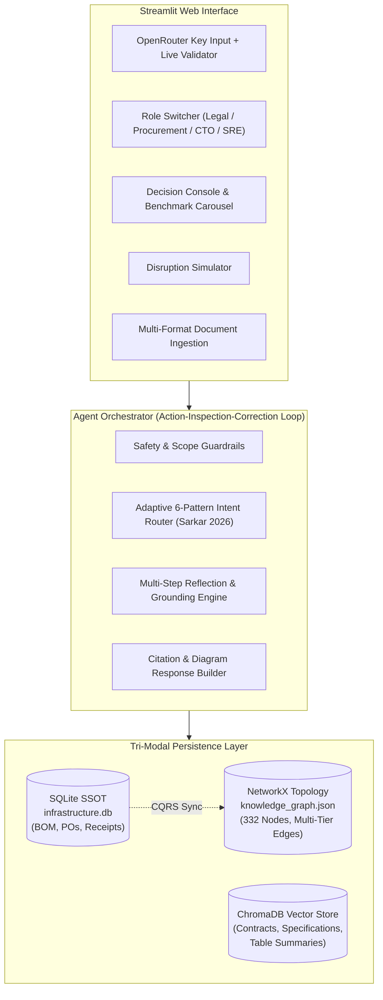

# Aethelgard Infra-GraphRAG
**A Sovereign AI Infrastructure & Supply Chain Intelligence Engine**

[](https://www.python.org/)
[](LICENSE)
[](#system-architecture)
[-brightgreen.svg)](#testing--verification)
[](#strict-engineering-principles-no-fakes-honest-errors)

---

## 1. What the Application Does

Modern sovereign AI data center operators operate in high-stakes environments where hardware procurement, multi-tier dependency networks, and complex legal obligations are deeply intertwined. When sudden disruptions strike—such as maritime route closures in East Asia, critical component single-source failures, or supplier restructuring—evaluating the operational, legal, and financial blast radius traditionally requires weeks of cross-departmental coordination.

**Aethelgard Infra-GraphRAG** is an autonomous, tri-modal Agentic AI system that unites:
1. **Physical Hardware Topologies & Multi-Tier Supplier Networks** (NetworkX Knowledge Graph with 332+ nodes and dependency chains)
2. **Contractual SLAs, Master Services Agreements & Sovereignty Standards** (ChromaDB Vector Index with Attribute-Based Access Control)
3. **Master BOM Inventories, Purchase Orders & Dock Receipts** (SQLite Relational Single Source of Truth)

The system dynamically reasons over these three modalities to answer complex executive questions, detect hidden inventory discrepancies (e.g. ERP purchase order vs. loading dock receipt shortfalls), simulate geopolitical disruptions, and provide verifiable audit trails.

---

## 2. Strict Engineering Principles: No Fakes, Honest Errors

This application adheres to a strict engineering standard: **zero hardcoded canned benchmark answers, and answer synthesis that never fakes success**.

- **Genuinely Grounded Retrieval**:
  - The SQL queries genuinely query the local `infrastructure.db` database using read-only PRAGMAs (`PRAGMA query_only = ON`).
  - The Graph queries genuinely traverse the NetworkX graph topology (finding Taiwan-dependent components, cooling pump failure blast radii, single-source bottlenecks, and software stack chains).
  - The Vector tool genuinely searches ChromaDB semantic collections filtered by role-based ABAC permissions.
- **Transparent LLM Synthesis & Error Surfacing**:
  - The natural-language executive answers are generated **exclusively by the live LLM provider** (OpenRouter) using the genuinely retrieved context.
  - If no OpenRouter API key is provided, if the key is invalid, or if an upstream rate limit (HTTP 429) occurs, the system **never fakes an answer or silently returns pre-written text**.
  - Instead, the agent transparently marks the response as incomplete (`is_complete = False`), surfaces the exact error message, provides instructions on how to input an API key, and renders the raw retrieved data rows and topology facts so the user can still inspect ground truth.

> **Scope of this guarantee (honesty note):** the *synthesis* path never fabricates. A few retrieval-level degraded fallbacks still exist (e.g. a keyword-overlap path in the ChromaDB adapter when the HNSW index is uncommitted, and a generic sample query in the SQL tool when Text-to-SQL fails). These are tracked for removal in [`docs/limitations.md`](docs/limitations.md).

---

## 3. System Architecture



### The Tri-Modal Modalities
1. **Relational SSOT (SQLite)**: Provides exact numerical accuracy for financial values, purchase order line items, lead times, safety stock balances, and dock receipt delivery records.
2. **Knowledge Graph (NetworkX)**: Models the structural topology:
   - Data center physical hierarchy: Data Center Room $\to$ Server Row $\to$ Rack $\to$ Blade Server $\to$ Accelerator / PSU.
   - Facility infrastructure: Cooling Loop $\to$ Heat Exchanger $\to$ Pump $\to$ Rack Cooling Manifold.
   - Multi-tier supply chain: Tier-1 Server Vendor $\to$ Tier-2 Module Integrator $\to$ Tier-3 Semiconductor Foundry.
3. **Semantic Vector Store (ChromaDB)**: Houses unstructured and semi-structured contracts, technical datasheets, EU AI Act compliance briefs, BSI C5 attestations, and tabular spreadsheet chunks.

### The 6 GraphRAG Architectural Patterns (Sarkar, 2026)
The agent router automatically classifies user intent into one of six distinct GraphRAG patterns:
- **`P1: Deterministic Text-to-Cypher`**: Direct graph traversal for single-source supplier discovery and entity-relationship queries.
- **`P2: Parallel Hybrid`**: Concurrent retrieval across vector contracts and relational SQL orders (e.g. evaluating Force Majeure clauses against delayed purchase orders and liquidated damages caps).
- **`P3: Sequential Graph-First`**: Graph traversal identifies cascading dependencies (e.g. Taiwan geopolitical disruption), followed by SQL joins to aggregate the financial order value of affected components.
- **`P4: Sequential Table-First`**: SQL query extracts hardware specifications and costs, followed by graph traversal to verify facility compatibility and thermal constraints.
- **`P5: Adaptive Router / Vector-Primary`**: Direct semantic vector search against regulatory and compliance corpuses (e.g. BSI C5 audit checklists, EU AI Act conformity assessments).
- **`P6: Agentic Multi-Step Loop`**: Iterative multi-hop reasoning with self-correction across all three modalities for complex disaster recovery and component runway planning.

### Attribute-Based Access Control (ABAC)
Documents and collections are partitioned across 4 persona clearance levels:
- **`LEGAL`**: Full access to Master Services Agreements, Force Majeure clauses, penalty terms, and regulatory documents.
- **`PROCUREMENT`**: Access to purchase orders, dock receipts, vendor scorecards, pricing sheets, and BOM catalogs.
- **`CTO / ARCHITECTURE`**: Access to technical engineering manuals, cooling topologies, ROCm/CUDA compatibility matrices, and rack specifications.
- **`SRE`**: Access to facility telemetry, cooling loop maps, and incident playbooks. **Strictly blocked** from confidential commercial pricing and supplier contracts.

---

## 4. How to Use the Application

### 1. API Key Setup & Live Validation
1. Launch the Streamlit application (`streamlit run app.py`).
2. In the left sidebar under **OpenRouter API Key**, paste your OpenRouter key (`sk-or-...`).
3. Click **Verify Key**.
4. The system sends a live verification request to `https://openrouter.ai/api/v1/auth/key`:
   - 🟢 **Connected**: Key is valid and active. Displays key label and enables full LLM synthesis.
   - 🟡 **Key Required**: Key is missing; UI operates in transparent retrieval-only mode with real error surfacing.
   - 🔴 **Invalid Key**: Key is rejected by OpenRouter; UI displays the exact HTTP status and error reason.
*(Note: You can also specify `OPENROUTER_API_KEY=...` in your local `.env` file.)*

> ⚠️ **Multi-user deployments:** clicking **Apply Key** sets the LLM provider **process-wide** (all browser sessions share it), and a key entered in the sidebar is visible to that session only. For public/multi-tenant deployments, configure the key exclusively via `.env` and put authentication in front of the app; treat the sidebar input as a single-user convenience.

### 2. Tab 1: Decision Console (AI Agent & Benchmarks)
- **Persona Switcher**: Choose your operational role (`LEGAL`, `PROCUREMENT`, `CTO`, or `SRE`) to apply proper ABAC permissions.
- **1-Click Benchmark Carousel**: Quick-test the system with real-world scenarios:
  1. *Taiwan Freight Corridor Disruption (Blast Radius & Blocked PO Value)*
  2. *Supermicro 10-Week Delay (Force Majeure vs. Liquidated Damages Cap)*
  3. *Single Point of Failure (Exclusive Supplier Bottlenecks)*
  4. *MI300X vs. H200 Architectural Comparison (Cost & Lead Times)*
  5. *BSI C5 & EU AI Act Sovereignty Compliance Audit*
  6. *Cooling Loop Pump Failure (Cascade to AI Racks)*
  7. *Broadcom 800G Transceiver Price Surge (15% Inflation Impact)*
  8. *ROCm & Kernel Driver Compatibility Verification*
  9. *Disaster Recovery & Component Runway Assessment*
  10. *Dock Receipt vs. ERP Discrepancy Detection (Trap 2)*
- **Natural Language Chat**: Ask arbitrary free-form questions about data center components, contracts, or suppliers.
- **Rich Footnote Citations**: Every generated response includes verifiable citations (`[1]`, `[2]`, ...).
  - Click **🔍 Inspect Full Source Text & Metadata** on any citation card to view an expandable drawer showing the exact document passage, the live SQL query and table rows, or the traversed graph entity path.
  - Graph citations identify the exact traversed entity topology (node/edge paths) — never an opaque serialized graph file.
- **Mermaid Diagrams**: Visual flowcharts and dependency cascades are automatically rendered directly below answers.
- **Discrepancy Banner**: If an ERP quantity does not match dock receipt delivery manifests, a prominent warning alert highlights the shortfall and recommended corrective action.

### 3. Tab 2: Disruption Simulator & Data Studio
- **1-Click Disruption Injection** (deterministic SSOT mutations + CQRS graph re-projection):
  - *Baseline Normal*: Resets supplier statuses and delayed purchase orders to normal operating parameters.
  - *Scenario A: Taiwan Freight Embargo*: Adds +16 weeks lead time to all Taiwan-dependent components.
  - *Scenario B: Submer Manifold Insolvency*: Marks the Submer supplier `IN_RESTRUCTURING` and freezes its purchase orders (`DELAYED`).
- **Live SSOT State Preview** (read-only):
  - Browse the current `components`, `purchase_orders`, and flagged `dock_receipts` discrepancy records.
- **Master Data Reset**: Regenerate the full synthetic BOM and re-seed the knowledge graph.

### 4. Tab 3: Topology & Analytics
- **Interactive Graph Visualizer**: Explore the 332-node infrastructure graph in 2D/3D using interactive physics-based controls (zoom, pan, drag nodes).
- **Network Metrics**: View node degree centrality, single-source bottlenecks, and cluster distribution.

### 5. Tab 4: Multi-Format Document Ingestion & Lifecycle
- **Supported File Types**:
  - PDF documents (`.pdf`)
  - Plain text & Markdown (`.txt`, `.md`)
  - Spreadsheet datasets (`.csv`, `.xlsx`, `.xls`)
- **Tabular Data Processing**:
  - When uploading CSV or Excel files, the system parses each sheet, extracts column headers, preserves tabular markdown structures, and generates chunk embeddings mapped to the `table_summaries` vector collection.
  - Interactive table preview allows inspecting spreadsheet rows in the browser prior to indexing.
- **Document Lifecycle & Deduplication**:
  - Generates SHA-256 content hashes.
  - Re-uploading a revised document automatically marks previous revisions as `deprecated` while preserving version history.

---

## 5. Installation & Setup

### Prerequisites
- Python 3.11+ (the Docker image uses 3.11-slim; a dedicated virtual environment is recommended)
- Git

> **Upgrading an existing checkout?** Generated data artifacts under `data/generated/` are *not* tracked in git, and their format has changed (the knowledge graph is now node-link JSON). After `git pull`, always re-run step 3 below — stale artifacts will fail to load.

### 1. Clone & Set Up Virtual Environment
```bash
# Clone the repository
git clone <repository-url>
cd <repository-directory>

# Create Python 3.12 virtual environment
python -m venv .venv

# Activate virtual environment
# Windows PowerShell:
.\.venv\Scripts\Activate.ps1
# Linux / macOS:
source .venv/bin/activate

# Upgrade pip and install dependencies
pip install --upgrade pip
pip install -r requirements.txt
```

### 2. Configure Environment Variables
Copy `.env.example` to `.env`:
```bash
cp .env.example .env
```
Edit `.env` and insert your private secrets:
```ini
OPENROUTER_API_KEY=sk-or-v1-your-key-here
```
*(Operational parameters such as model names, temperature, timeouts, and chunking parameters are strictly managed in `config.json`.)*

> **EU sovereignty model routing** — the default LLM is `deepseek/deepseek-v4-flash-0731`, served exclusively by European
> providers (`Nebius` 🇳🇱, `Inceptron` 🇸🇪/🇫🇮, `NextBit` 🇪🇸) with `allow_fallbacks: false` so requests never silently
> egress to non-EU hosts. `data_collection: deny` + `zdr: true` are also set. The app auto-retries transient upstream 429s
> (3 attempts, backoff) and, if the LLM call ultimately fails, **stops with the exact error** instead of returning any
> fallback text. Switch the model/provider order in `config.json` under `llm.provider_routing`.

### 3. Generate Datasets & Knowledge Bases
Execute the data generation and indexing pipeline:
```bash
# 1. Generate Master BOM, Purchase Orders, and Dock Receipts (SQLite + CSV)
python scripts/generate_bom.py

# 2. Compile Synthetic Contracts, SLAs, and Compliance PDFs
python scripts/generate_documents.py

# 3. Compile the NetworkX Knowledge Graph from SQLite SSOT
python scripts/seed_graph.py

# 4. Ingest and Embed Documents into ChromaDB Vector Collections
python ingestion/embedder.py

# 5. Validate 100% Referential Integrity across SQL, Graph, and Vector Stores
python scripts/validate_data.py
```

### 4. Launch the Web Application
```bash
streamlit run app.py
```
Open your browser to `http://localhost:8501`.

---

## 6. Docker Deployment

A self-contained Docker setup (demo/evaluation grade) is included:

```bash
# Build & start (generates synthetic data inside the container)
docker compose -f docker-compose.deploy.yml up -d --build

# App is served at http://localhost:8510
# Set OPENROUTER_API_KEY to enable live LLM reasoning
```

- **Dockerfile** — Python 3.11-slim image; generates BOM/documents/graph/Chroma index at build time so the container is self-contained; runs as a **non-root user** with a built-in `HEALTHCHECK` against Streamlit's `/_stcore/health`.
- **Ports** — Binds `127.0.0.1:8510` → container `8501` (loopback only; put a reverse proxy with authentication in front for any public exposure).
- **API key** — Pass `OPENROUTER_API_KEY` via the environment/compose; without it the app runs in transparent retrieval-only mode (see §2).

---

## 7. Testing & Verification

The test suite contains 28 unit and integration tests covering the entire end-to-end pipeline:
- Ingestion parsers (PDF, TXT, CSV, Excel)
- Section chunkers & table pagination
- Pre-retrieval safety & prompt injection guardrails
- 6-pattern intent classification router
- Tri-modal retrieval tools (SQL, NetworkX Graph, ChromaDB ABAC)
- Reflection loop and citation generation
- Transparent error handling when external LLM providers fail

Run all tests:
```bash
python -m pytest tests/ -v
```

Run test suite with code coverage (all packages):
```bash
python -m pytest tests/ --cov=agent --cov=retrieval --cov=ingestion --cov=ports --cov=services --cov=ui --cov=utils --cov=app --cov-report=term-missing
```

Run the 30-query RAG evaluation suite (10 benchmarks, 5 adversarial injections, 5 out-of-domain refusals, 10 extended queries; all 5 metrics computed per run, results saved to `data/generated/rag_eval_results.json`):
```bash
python scripts/evaluate_rag.py
```

---

## 8. Repository Structure

```
├── app.py                         # Clean Streamlit shell entry point with API key management
├── config.json                    # Operational settings, model configs, and path resolutions
├── .env.example                   # Template for private credentials
├── Dockerfile                     # Docker build (python:3.11-slim, non-root, healthcheck)
├── docker-compose.deploy.yml      # Docker compose production deployment definition
├── requirements.txt               # Minimum-version dependencies (pin exact versions before production)
├── ui/                            # Streamlit Presentation Layer
│   ├── tab_decision_console.py    # Tab 1: AI Chat, 1-Click Carousel & Citation Previews
│   ├── tab_simulation.py          # Tab 2: Disruption Simulator & SQL Studio
│   ├── tab_analytics.py           # Tab 3: PyVis Interactive Graph & Analytics
│   └── tab_ingestion.py           # Tab 4: PDF, TXT, CSV & Excel Ingestion & Preview
├── agent/                         # Core Agentic Intelligence
│   ├── orchestrator.py            # Reflection loop (Action-Inspect-Correct)
│   ├── intent_router.py           # 6-Pattern classifier (Sarkar 2026)
│   ├── guardrails.py              # Pre/post retrieval safety & injection filters
│   └── response_builder.py        # Confidence scoring & citation models
├── retrieval/                     # Tri-Modal Retrieval Engines
│   ├── sql_query.py               # Read-only SQLite query tool (PRAGMA query_only=ON)
│   ├── graph_query.py             # NetworkX topology traversals & dependency analysis
│   └── vector_search.py           # ChromaDB semantic search with ABAC filters
├── ingestion/                     # Ingestion & Lifecycle Pipeline
│   ├── parser.py                  # PyMuPDF, Pandas & OpenPyXL document parsers
│   ├── chunker.py                 # Structured chunker with table pagination
│   ├── embedder.py                # ChromaDB vector indexer
│   └── lifecycle.py               # SHA-256 deduplication & deprecation manager
├── ports/                         # Hexagonal Port Interfaces & Concrete Adapters
│   ├── base.py                    # VectorStorePort, GraphStorePort, LLMProviderPort
│   ├── vector_store/              # ChromaDBAdapter
│   ├── graph_store/               # NetworkXAdapter
│   ├── llm_provider/              # OpenRouterAdapter with live key verification
│   └── registry.py                # Dependency injection container
├── scripts/                       # Dataset Generation & Evaluation
│   ├── generate_bom.py            # SQLite database & CSV generator
│   ├── generate_documents.py      # Synthetic contracts & PDF generator
│   ├── seed_graph.py              # SQLite-to-NetworkX graph builder
│   ├── validate_data.py           # Referential integrity auditor
│   └── evaluate_rag.py            # 30-query RAG evaluation suite (computed metrics)
├── templates/                     # Standalone HTML templates for PDF generation
├── docs/                          # Architectural & Design Specifications
│   ├── architecture.md            # Detailed Tri-Modal CQRS system architecture
│   ├── agent_roles.md             # Persona permissions & ABAC security matrix
│   └── limitations.md             # Prototype constraints & production roadmap
└── tests/                         # Automated Test Suite (pytest)
    ├── unit/                      # Unit tests for chunker, guardrails, router
    └── integration/               # Integration tests for tools, ingestion, e2e agent
```

---

## 9. Troubleshooting (First-Time Users)

| Symptom | Cause | Fix |
|---|---|---|
| Answers show “⚠️ LLM Synthesis Required … API Key Not Configured” with raw retrieved data below | No usable `OPENROUTER_API_KEY` | Enter a key in the sidebar (**Verify Key** first) or add it to `.env`, then rerun the query. Retrieval, citations, and the execution trace remain fully functional without a key |
| Answers stop with **⛔ Synthesis Failed** and an error banner | The retrieval layer ran, but LLM answer synthesis failed (missing/invalid key, provider 429, or network error) | The app intentionally **stops at the error** — no simulated or template answer is shown. Verify the key in the sidebar, check the provider/model in `config.json`, and retry |
| Error details show `HTTP 429` from OpenRouter | **Shared-pool rate limit on the upstream provider** (not a credit issue) or transient provider saturation | The adapter now **auto-retries transient 429s** (3 attempts, backoff). If it persists, the provider pool itself is saturated — try again shortly or switch model/provider routing in `config.json`; the agent surfaces the provider error verbatim instead of faking an answer |
| `UnpicklingError` or graph-load traceback at startup or in tests | Stale `data/generated/` artifacts from an older checkout | Re-run the generation pipeline: `python scripts/generate_bom.py && python scripts/seed_graph.py && python ingestion/embedder.py` |
| Tests fail on a fresh clone | Generated datasets are not in git by design | Run the step-3 generation commands, then `python -m pytest tests/` |
| `table_summaries` collection shows 0 chunks | No seed document is tabular yet | Upload a `.csv`/`.xlsx` via Tab 4 — tabular parsing maps into that collection |
| Sidebar shows 🟡 “Synthesis Offline” | No key configured (expected state) | Same as row 1; retrieval-only mode is intentional, not a bug |

Known prototype constraints and the production roadmap are documented in [`docs/limitations.md`](docs/limitations.md).

---

## 10. Standards & Regulatory Compliance

This system is engineered in accordance with European and sovereign cloud security frameworks:
- **[Regulation (EU) 2024/1689 (EU AI Act)](https://eur-lex.europa.eu/legal-content/EN/TXT/?uri=CELEX:32024R1689)** — High-risk transparency, human oversight, and data governance.
- **[German BSI Cloud Computing Compliance Criteria Catalogue (C5:2024)](https://www.bsi.bund.de/EN/Themen/Unternehmen-und-Organisationen/Standards-und-Zertifizierung/IT-Grundschutz/Zertifizierung-nach-IT-Grundschutz/C5/c5_node.html)** — Security, auditing, and sovereignty controls for cloud infrastructure.
- **[Directive (EU) 2022/2555 (NIS2 Directive)](https://eur-lex.europa.eu/eli/dir/2022/2555/oj)** — Measures for a high common level of cybersecurity across critical supply chains within the European Union.
